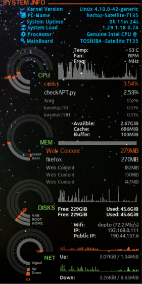

ConkySlot
=========

A Conky theme that modify from conky seamod

USAGE:
=======
After download it place the folder to home directory.And paste fonts into ~/.fonts folder.Then Run the ConkyStart.sh file.Enjoy.

Dependency for HDD,CPU temperature install those packages: hdd-temp,lm-sensor,dmidecode

Screenshot:
==========

